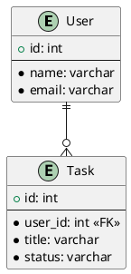

# DB設計書

## ER図

---

## テーブル定義

### tasks テーブル

タスク情報を格納するテーブル。

| カラム名   | データ型       | Null許容 | 主キー | 説明             |
| :--------- | :------------- | :------- | :----- | :--------------- |
| id         | `SERIAL`       | No       | PK     | タスクID         |
| title      | `VARCHAR(255)` | No       |        | タスクのタイトル |
| status     | `VARCHAR(10)`  | No       |        | 状態             |
| created_at | `TIMESTAMP`    | No       |        | 作成日時         |
| updated_at | `TIMESTAMP`    | No       |        | 更新日時         |